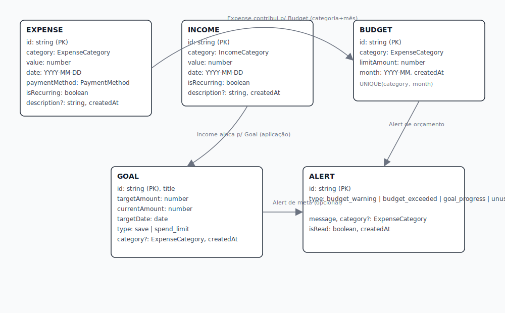
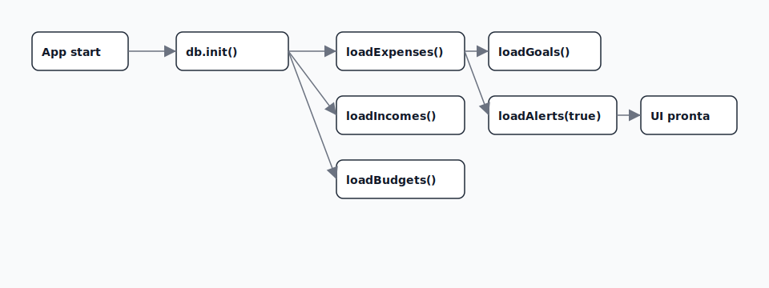
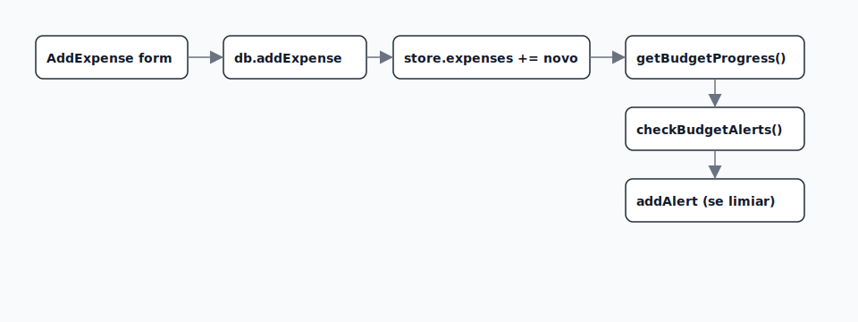
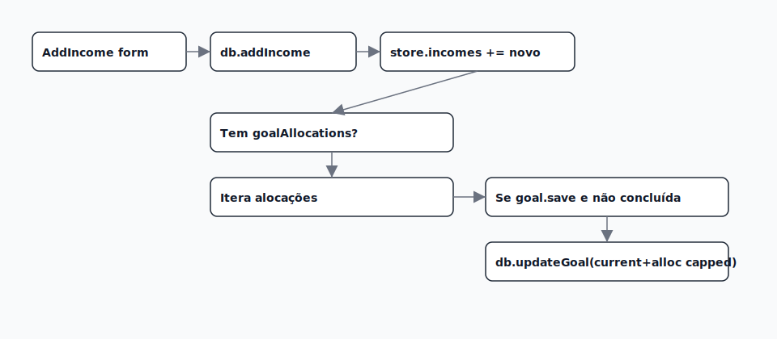
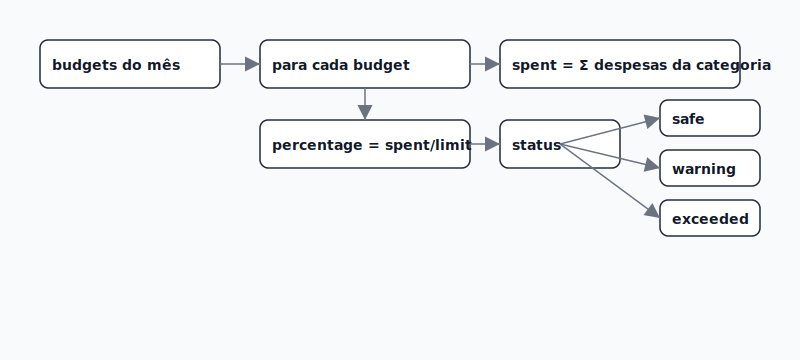
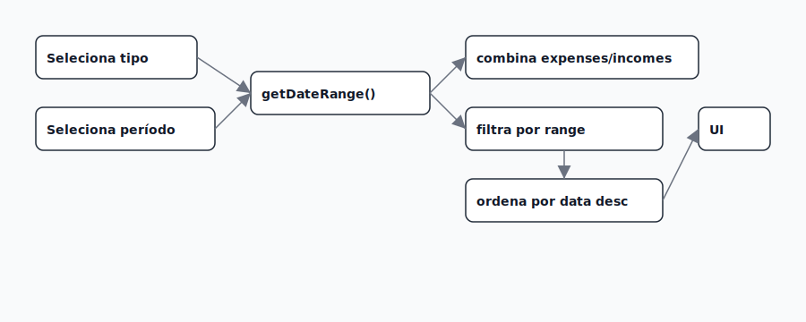
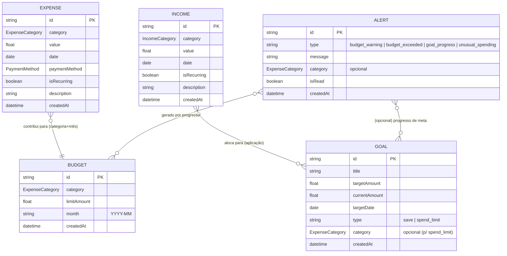
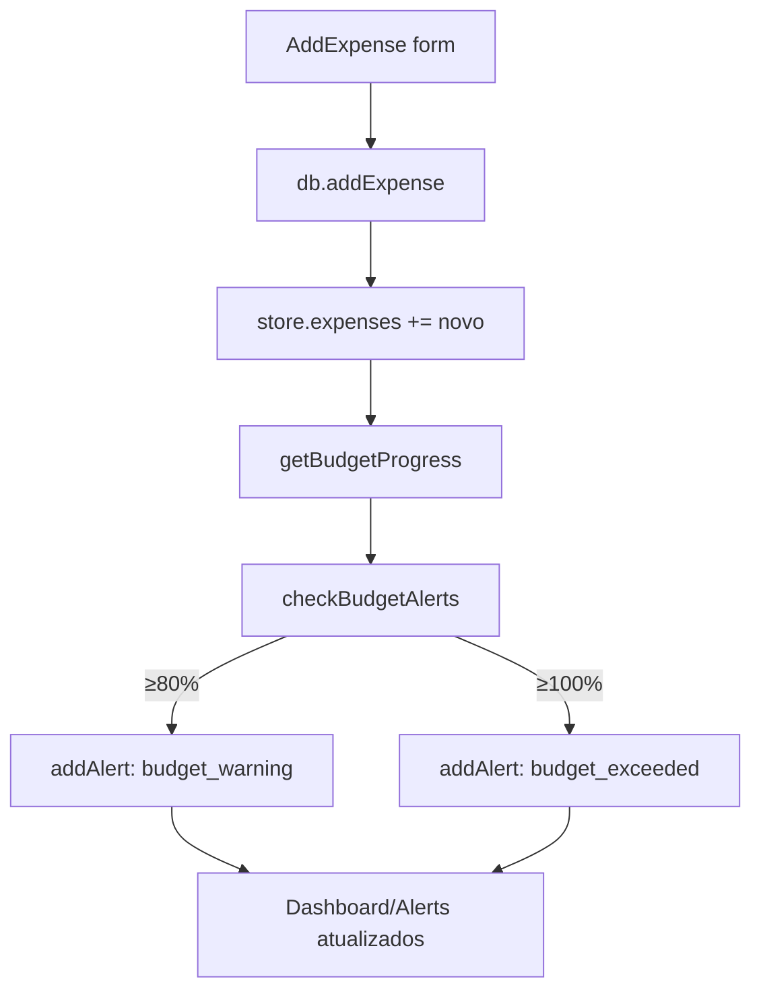
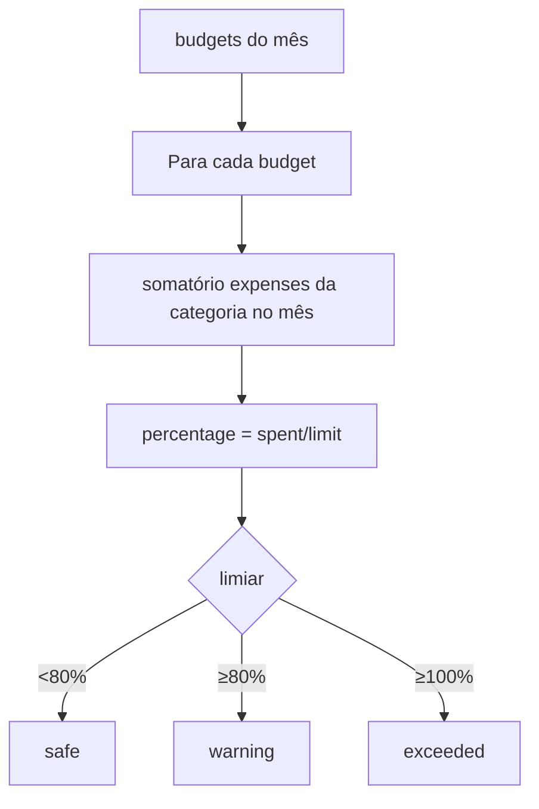

# Finance App — Documentação Técnica para Desenvolvedores

Este guia descreve como a aplicação funciona do ponto de vista de programação: arquitetura, estado, persistência, regras de negócio e o comportamento de cada tela, além de pontos de extensão.

## Visão Geral da Arquitetura

- Stack
  - Expo SDK 54, React Native, TypeScript
  - React Navigation (Tabs + Stack): `src/navigation/AppNavigator.tsx`
  - React Native Paper (MD3) + `@expo/vector-icons`
  - Zustand para estado global: `src/store/financeStore.ts`
  - Animações com `react-native-reanimated@~4.1.1`
- Persistência (selecionada em runtime): `src/services/database.ts`
  - Nativo (Android/iOS): SQLite via `expo-sqlite` → `src/services/SQLiteDatabaseService.ts`
  - Web: IndexedDB/localStorage via `localforage` → `src/services/WebDatabaseService.ts`
- Tema
  - Tokens e temas: `src/theme/index.ts`
  - Uso recomendado: `useTheme()` do Paper (evitar objeto estático para UI reativa)
- Entrada
  - `index.ts` → `App.tsx` (registra tema, ícones e navegação)

## Modelo de Domínio (src/types/index.ts)

- `Expense`: categoria (`ExpenseCategory`), valor, data ISO (YYYY-MM-DD), método, recorrente, descrição?, `id`, `createdAt`
- `Income`: categoria (`IncomeCategory`), valor, data, recorrente, descrição?, `goalAllocations?`, `id`, `createdAt`
- `Budget`: categoria, `limitAmount`, `month` (YYYY-MM), `id`, `createdAt`
- `Goal`: `title`, `targetAmount`, `currentAmount`, `targetDate`, `type: 'save'|'spend_limit'`, `category?`, `id`, `createdAt`
- `Alert`: `type: 'budget_warning'|'budget_exceeded'|'goal_progress'|'unusual_spending'`, `message`, `category?`, `isRead`, `id`, `createdAt`
- `BudgetProgress`: `category`, `limitAmount`, `spent`, `percentage`, `status: 'safe'|'warning'|'exceeded'`

## Persistência e Seleção de Backend

- `src/services/database.ts`
  - Se `Platform.OS === 'web'` → `WebDatabaseService`
  - Caso contrário → carrega `SQLiteDatabaseService` via `require` (import dinâmico)
  - Exporta `db` (Proxy) e `getDatabaseSync()` — todas as chamadas da store passam por aqui
- SQLite (nativo): `src/services/SQLiteDatabaseService.ts`
  - BD: `finance_app.db`, tabelas para expenses, incomes, budgets, goals, alerts (com índices)
- Web (browser): `src/services/WebDatabaseService.ts`
  - Stores separados com `localforage` (chaves: ids; orçamentos por `category_month`)

## Estado Global (Zustand) — src/store/financeStore.ts

- Estado: `expenses`, `incomes`, `budgets`, `goals`, `alerts`, `isLoading`
- Inicialização: `initialize()`
  - Cria/abre DB, carrega mês atual (despesas/receitas), orçamentos do mês, metas e alertas não lidos
- Ações principais
  - `addExpense`, `loadExpenses`, `deleteExpense`
  - `addIncome`, `loadIncomes`, `deleteIncome`
  - `setBudget`, `loadBudgets`
  - `addGoal`, `loadGoals`, `updateGoal`, `deleteGoal`
  - `addAlert`, `loadAlerts`, `markAlertAsRead`
- Seletores/utilitários
  - `getBudgetProgress()` → agrega despesas por categoria no mês corrente e compara com `limitAmount` (status: `safe|warning|exceeded` com limites 80%/100%)
  - `getMonthlyTotal()` (soma despesas), `getMonthlyIncome()` (soma receitas)
- Regras importantes
  - Alertas: `checkBudgetAlerts()` é chamado após alterações relevantes e cria banners de `budget_warning` (≥80%) e `budget_exceeded` (≥100%)
  - Alocação de receitas em metas: `addIncome()` aplica `income.goalAllocations` SOMENTE nas metas selecionadas do tipo `save`, ignorando metas concluídas (cap em `targetAmount`)

## Tema e Tokens — src/theme/index.ts

- `lightTheme` / `darkTheme` estendem MD3 (Paper): cores (primary, success, warning, surfaceVariant, etc.), `roundness`
- Tokens utilitários: `spacing`, `typography`, `shadows`
- Compat: `export const theme = lightTheme` (para arquivos legados). Preferencialmente usar `useTheme()` do Paper em componentes/screens.

## Navegação — src/navigation/AppNavigator.tsx

- Tabs: `Dashboard`, `Timeline`, `Budgets`, `Goals`
- Stack adicional: `AddExpense`, `AddIncome`, `Alerts`
- `headerRight`: botão para alternar tema (usa `useThemeStore`)

## Telas (Comportamento e Pontos de Extensão)

### Dashboard — src/screens/DashboardScreen.tsx
- Fontes de dados
  - `useFinanceStore()` para alertas e progresso de orçamentos
  - `useFinanceEngine()` para `dashboardData` (mensal: total gasto, projeção, etc.)
- UI
  - Banners de alerta (coloridos, com ícone e dismiss)
  - Resumo do mês (total gasto + projeção)
  - Gráfico de Gastos por Categoria (`AnimatedBarChart`)
  - Lista de orçamentos com `ProgressBar`
  - FAB abre `TransactionTypeSheet` (navega para `AddExpense`/`AddIncome`)
- Extensão
  - Adicionar mais KPIs ou filtros no gráfico
  - Conectar “alertas” a ações (ex.: atalho para Orçamentos)

### Timeline — src/screens/TimelineScreen.tsx
- Estado local: `viewMode` (`all|expenses|incomes`), `period`, `menuVisible`
- Derivação: filtra transações por `getDateRange(period)` e ordena por data desc
- UI
  - `SegmentedButtons` para tipo
  - Dropdown de período com `Menu` (usa `anchorPosition="bottom"` e `Menu.Item`)
  - Item com: categoria (ponto colorido), ícone de direção (gasto/receita), valor, data, descrição, método (se gasto); ações de editar/excluir
- Extensão
  - Busca textual e filtros por categoria/método
  - Exportar CSV do período

### Orçamentos — src/screens/BudgetsScreen.tsx
- Define limite mensal por categoria para o mês atual (`YYYY-MM`)
- Consulta `getBudgetProgress()` para exibir andamento (valor gasto / limite + %)
- Extensão
  - Criar orçamentos para meses futuros
  - Histórico e comparativo por mês

### Metas — src/screens/GoalsScreen.tsx
- Cria metas `save` (economizar) ou `spend_limit`
- Mostra progresso com barra e ETA (via engine)
- Lixeira remove meta
- Extensão
- Objetivos com prioridade e alocação automática de receitas

### AddExpense — src/screens/AddExpenseScreen.tsx
- Form (RHF + Zod): valor, descrição, categoria, método, recorrência
- `addExpense()` → persiste em DB → atualiza estado → `checkBudgetAlerts()` pode gerar alertas; volta para tela anterior
- Extensão
  - Notas com fotos (ex.: recibos) usando `expo-image-picker`/`expo-file-system`

### AddIncome — src/screens/AddIncomeScreen.tsx
- Form (RHF + Zod): valor, descrição, categoria, recorrência
- Opcional: alocar a metas (UI de alocação; `goalAllocations` vai junto da receita)
- A store aplica as alocações apenas às metas selecionadas e respeita `targetAmount`
- Extensão
  - Regras de alocação (proporcional/percentual) e presets

### Alerts — (se necessário implementar/ajustar)
- Lista alertas (não lidos primeiro), ação de marcar como lido via `markAlertAsRead(id)`

## Componentes Reutilizáveis

- `Card` — src/components/Card.tsx
  - Recebe `variant: 'elevated'|'outlined'|'flat'`; usa `useTheme()` para cores/bordas
- `AlertBanner` — src/components/AlertBanner.tsx
  - Fundo segue severidade (no dark, translúcido da cor) e texto usa a cor do alerta
- `ProgressBar` — src/components/ProgressBar.tsx
  - Anima porcentagem; cor automática por limiar (success/warning/error) ou via `color`
- `AnimatedBarChart` — src/components/AnimatedBarChart.tsx
  - Barras animadas com delay incremental; textos seguindo `useTheme()`
- `TransactionTypeSheet` — src/components/TransactionTypeSheet.tsx
  - Bottom sheet simples com ações “Gasto”/“Receita”

## Regras de Negócio Chave

- Progresso de Orçamento
  - `spent` = soma de `expenses` por categoria (mês corrente)
  - `status`: `safe` (<80%), `warning` (≥80%), `exceeded` (≥100%)
  - Alertas gerados por `checkBudgetAlerts()` com mensagens específicas
- Receitas x Metas
  - Alocação opcional por meta (somente tipo `save`)
  - Metas concluídas (current ≥ target) não recebem alocação
  - Cap em `targetAmount` (não ultrapassa)

## Tema e Acessibilidade

- Use `useTheme()` nas telas/estilos para respeitar claro/escuro
- Cores de texto recomendadas: `onSurface` e `onSurfaceVariant` (evita contraste baixo)
- Ícones via `@expo/vector-icons/MaterialCommunityIcons` (registrado em `App.tsx` no `PaperProvider.settings.icon`)

## Convenções e Formatos

- Datas de transação: `YYYY-MM-DD`
- Mês de orçamento: `YYYY-MM`
- IDs: prefixos (`exp_`, `inc_`, `bud_`, `goal_`, `alert_`) + timestamp + sufixo aleatório

## Pontos de Extensão

- Exportar/Importar dados (CSV/JSON): adicionar métodos no `IDatabaseService` e ações na `Timeline`
- Sincronização remota: criar camada de sync (ex.: REST/GraphQL) mapeando entidades locais ↔ remotas
- Notificações e lembretes: `expo-notifications` para alertas de orçamento/metas (agendamento)
- Personalização de categorias: mover enum para coleção dinâmica (tabela/armazenamento) e adicionar CRUD

## Compat/Versionamento

- Expo SDK 54: combine com `react-native-reanimated@~4.1.1` e `react-native-worklets@0.5.1`
- Ícones e tema já estão compatíveis com Expo Go; para libs nativas fora da compatibilidade → usar Development Build

## Dicas de Debug

- Limpar cache do bundler: `npx expo start --clear`
- Problemas de rede/QR: `npx expo start --tunnel`
- Ver dados rapidamente (Web): abra o DevTools → Application → IndexedDB/localforage
- SQLite (nativo): para exportar o DB, copie `finance_app.db` para um diretório compartilhado usando `expo-file-system`

## Diagramas (SVG)

Para visualização rápida sem renderização de Mermaid, os SVGs a seguir representam os mesmos fluxos/modelagem (ilustrativos):

- ER (Modelo de Entidade/Relacionamento)

  

- Fluxo — Inicialização do App

  

- Fluxo — Adicionar Gasto e Checar Alertas

  

- Fluxo — Adicionar Receita com Alocações de Meta

  

- Fluxo — Cálculo de Progresso de Orçamento

  

- Fluxo — Filtro/Período na Timeline

  

## Diagramas ER (Conceitual)

> Observação: algumas “relações” são derivadas por regra de negócio (não há FK física). Ex.: `Budget` é por categoria+mês; `Expense` contribui para o orçamento do mês da sua categoria; alocações de `Income` para `Goal` são aplicadas pela store e não ficam registradas em uma tabela de junção.



### Enumerations (conceituais)

- `ExpenseCategory`: food, transport, health, entertainment, shopping, bills, education, other
- `IncomeCategory`: salary, freelance, investment, gift, other
- `PaymentMethod`: cash, credit, debit, pix

## Fluxogramas (Principais Processos)

### Inicialização do App

```mermaid
flowchart TD
  A[App start] --> B[db.init]
  B --> C[loadExpenses(mês atual)]
  B --> D[loadIncomes(mês atual)]
  B --> E[loadBudgets(mês atual)]
  B --> F[loadGoals]
  B --> G[loadAlerts(unreadOnly)]
  C & D & E & F & G --> H[UI pronta]
```

### Adicionar Gasto e Checar Alertas



### Adicionar Receita com Alocações de Meta

```mermaid
flowchart TD
  A[AddIncome form] --> B{Tem goalAllocations?}
  B -- não --> C[db.addIncome]
  B -- sim --> C
  C --> D[store.incomes += novo]
  B -- sim --> E[Para cada alocação]
  E --> F[goal = find(goalId)]
  F --> G{goal.type==save e não concluída}
  G -- sim --> H[nextAmount = min(target, current + alloc)]
  H --> I[db.updateGoal]
  I --> J[store.goals atualiza currentAmount]
  G -- não --> K[ignora]
  D & J --> L[UI atualizada]
```

### Cálculo de Progresso de Orçamento



### Filtro/Período na Timeline

```mermaid
flowchart TD
  A[Seleciona tipo (Todos/Gastos/Receitas)] --> B
  C[Abre menu período] --> D[Escolhe: mês, 3/6m, ano, tudo]
  B & D --> E[range = getDateRange]
  E --> F[combina expenses/incomes conforme tipo]
  F --> G[filtra por range]
  G --> H[ordena por data desc]
  H --> I[renderiza lista]
```
