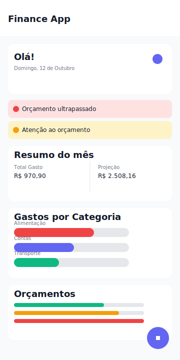
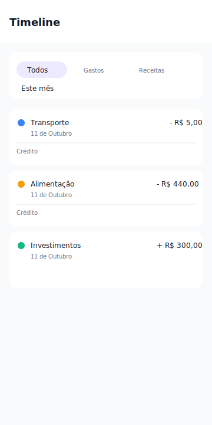
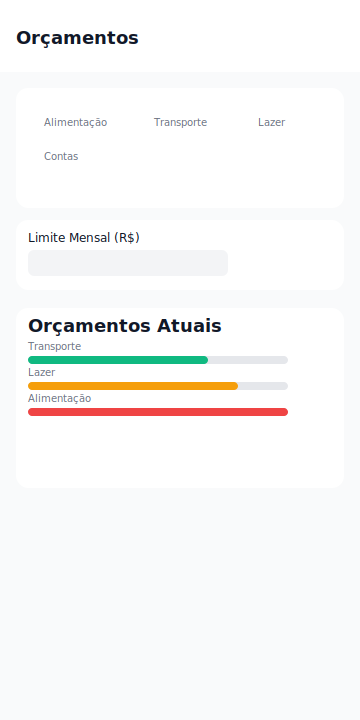
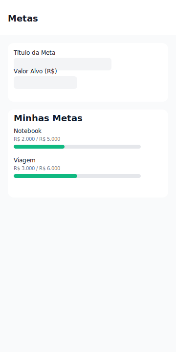

# Finance App — Guia de Uso e Domínio da Plataforma

Este app (Expo/React Native) ajuda você a controlar gastos, definir orçamentos mensais, criar metas e acompanhar tudo em tempo real com um visual consistente (claro/escuro).

## Como Rodar

- Pré‑requisitos: Node.js LTS, npm e o app Expo Go no celular.
- Instalação: `npm install`
- Iniciar: `npx expo start` (se a LAN não conectar, use `npx expo start --tunnel`)
- Abra no celular com o QR do terminal/DevTools (Expo Go instalado).

## Visão Geral das Funcionalidades

- Dashboard
  - Alertas inteligentes (ex.: orçamento perto do limite/estourado).
  - Resumo do mês (total gasto e projeção até o fim do mês).
  - Gastos por Categoria (gráfico animado e cores por categoria).
  - Orçamentos em andamento com progresso visual.
  - Acesso rápido (botão “+”) para registrar gasto/receita.

- Timeline
  - Lista todas as transações (gastos e receitas) com data e categoria.
  - Filtros por tipo (Todos | Gastos | Receitas).
  - Período: Este mês, Últimos 3/6 meses, Último ano, Tudo (menu dropdown).
  - Ações rápidas: editar, excluir, identificar recorrência e método de pagamento.

- Orçamentos
  - Defina limites mensais por categoria.
  - Veja o andamento (valor gasto / limite) e percentual com cores de status.

- Metas
  - Crie metas do tipo “Economizar” (save) ou “Limite de Gastos” (spend_limit).
  - Acompanhe o progresso e o ETA (previsão de conclusão).
  - Alocação de Receitas: direcione parte de uma receita para uma ou mais metas.

- Alertas
  - Gatilhos automáticos quando um orçamento entra em “atenção” (≥80%) ou “estourado” (≥100%).
  - Podem ser marcados como lidos e some da lista de não lidos no Dashboard.

- Tema Claro/Escuro
  - Alternância no ícone do cabeçalho. Toda a UI respeita o tema atual.

## Fluxo de Uso Recomendado

1) Configurar Orçamentos
   - Acesse Orçamentos → selecione uma categoria → defina “Limite Mensal (R$)”.
   - O Dashboard passa a exibir o progresso e pode emitir alertas.

2) Criar Metas
   - Acesse Metas → escolha o tipo (Economizar/ Limite de Gastos) → informe título, valor‑alvo e confirme.
   - As metas do tipo “Economizar” podem receber alocações de receitas.

3) Registrar Gastos/Receitas
   - Pelo Dashboard (botão “+”) ou pelas telas dedicadas.
   - Gastos: informe valor, categoria, método de pagamento, se é recorrente e descrição.
   - Receitas: informe valor, categoria e (opcional) aloque parte dessa receita para metas de “Economizar”.

4) Acompanhar e Ajustar
   - Dashboard: veja resumo do mês, gráfico por categoria e andamento dos orçamentos.
   - Timeline: mude o período/filtro e edite/exclua lançamentos se necessário.
   - Metas: monitore o progresso e exclua metas concluídas que não deseja mais exibir.

## Como as Partes se Integram

- Gastos → Orçamentos/Alertas
  - Cada gasto incrementa o total da categoria no mês atual.
  - O progresso do orçamento muda e pode gerar alerta (≥80% atenção, ≥100% estourado).

- Receitas → Metas
  - Ao adicionar uma receita, você pode distribuir valores para metas do tipo “Economizar”.
  - Metas concluídas (valor atual ≥ valor‑alvo) são ignoradas nas novas alocações.

- Dashboard
  - Consolida tudo: alertas, resumo mensal (inclui projeção), gráfico por categoria e andamento dos orçamentos.

- Timeline
  - Reflete todos os lançamentos (gastos e receitas) do recorte de tempo selecionado.

## Uso das Telas em Detalhes

### Dashboard

- Saudação e data atual
- Alertas
  - Banners coloridos (vermelho/laranja/verde) — toque no “X” para dispensar.
- Resumo do mês
  - “Total Gasto” e “Projeção” do mês (cores respeitam o tema).
- Gastos por Categoria (gráfico animado)
  - Barras com largura proporcional ao maior valor; cada item mostra rótulo, % e valor.
- Orçamentos
  - Lista com barra de progresso: verde (<80%), laranja (≥80%) e vermelho (≥100%).
- Botão “+”
  - Abre um sheet para escolher Gasto/Receita.

### Timeline

- Filtro por tipo (Segmented Buttons): Todos | Gastos | Receitas.
- Botão de período (menu)
  - Toque no seletor “Este mês” → escolhe: Este mês, Últimos 3/6 meses, Último ano, Tudo.
- Lista de itens
  - Cor da bolinha indica a categoria; setas vermelha/verde marcam gasto/receita.
  - Ações: editar (lápis) e excluir (lixeira).
  - Mostra descrição, data formatada e, em gastos, o método de pagamento.

### Orçamentos

- Grade de categorias; selecione uma e defina o limite mensal.
- Progresso por categoria com valores absolutos (gasto / limite) e percentual.

### Metas

- Nova Meta: título, valor‑alvo, tipo (Economizar ou Limite de Gastos).
- Lista de Metas
  - Mostra a barra de progresso, % e um ETA (previsão).
  - A lixeira remove a meta.
- Alocação de Receitas
  - Ao criar uma receita, você pode distribuir parte do valor para metas de “Economizar”.

## Tema e Personalização

- Alternância de tema: ícone no cabeçalho (sol/lua).
- Cores e tokens principais em `src/theme/index.ts`:
  - `lightTheme` e `darkTheme` estendem o MD3 do React Native Paper.
  - `spacing`, `typography` e `shadows` para padronização visual.

## Dicas Rápidas

- Rede/QR não conecta? Use `npx expo start --tunnel`.
- Ícones: utilizamos `@expo/vector-icons` (MaterialCommunityIcons) e o Paper está configurado para esses ícones.
- Android (emulador/“a”): precisa de SDK/ADB. Para usar só no celular, o Expo Go basta.

## Armazenamento de Dados (resumo)

- Mobile (nativo): SQLite (via serviço específico de banco).
- Web: IndexedDB/localStorage usando `localforage`.

## Onde Ficam as Principais Coisas

- Estado e Regras de Negócio: `src/store/financeStore.ts`
- Ecrãs: `src/screens/*`
- Componentes: `src/components/*`
- Tema: `src/theme/index.ts`
- Constantes (categorias, rótulos): `src/constants`

---

Com isso você domina o fluxo: defina orçamentos, crie metas, registre gastos/receitas (alocando valores quando fizer sentido) e acompanhe tudo pelo Dashboard e Timeline. Qualquer ajuste que queira no design ou comportamento, posso orientar aonde mexer no código.

## Screenshots (ilustrativas)

As imagens abaixo são mockups em SVG (leves e versionáveis) para ilustrar as telas principais. Substitua por capturas reais quando desejar.

- Dashboard

  

- Timeline

  

- Orçamentos

  

- Metas

  

## FAQ / Problemas Comuns

- QR/Conexão não abre no celular
  - Use: `npx expo start --tunnel`.
  - Libere o `node.exe` na firewall (rede privada) e evite VPN.

- Pressionar “a” não funciona / ADB ausente
  - “a” abre em emulador via ADB. Instale Android Studio/SDK ou use somente o Expo Go no celular (sem Android Studio).

- Erro “Cannot find module babel-preset-expo”
  - Instale como devDependency (já incluso). Se persistir: apague `node_modules` + `package-lock.json` e rode `npm install`.

- WorkletsError (mismatch Reanimated/Worklets)
  - As versões foram alinhadas para o Expo SDK 54 (`react-native-reanimated@~4.1.1` + `react-native-worklets@0.5.1`). Se mudar versões, use Development Build ou volte a compatível com o SDK.

- Ícones não aparecem
  - Usamos `@expo/vector-icons` e registramos no `PaperProvider`. Rode `npm install` e reinicie com `npx expo start --clear`.

- Menu de período na Timeline não abre
  - O `Menu` usa `anchorPosition="bottom"`. Se estiver dentro de ScrollView complicada, prefira ancorar com `Menu.Anchor` ou usar um portal. Já deixamos configurado para abrir abaixo do botão.

- Texto ilegível no modo escuro
  - As telas principais usam `useTheme()` do React Native Paper e paleta ajustada. Se algum texto ainda ficar “fraco”, ajuste em `src/theme/index.ts` ou use `useTheme()` na tela/componente e aplique `theme.colors.onSurface`/`onSurfaceVariant`.

- “Expo Go não abre / bundle 500”
  - Limpe cache: `npx expo start --clear`.
  - Confirme que o `expo`/SDK do projeto corresponde ao Expo Go instalado (SDK 54).

- “Quero atualizar libs nativas”
  - Use `npx expo install <pacote>` para pegar versões compatíveis. Para versões além da compatibilidade, gere um Development Build (`npx expo run:android`).
